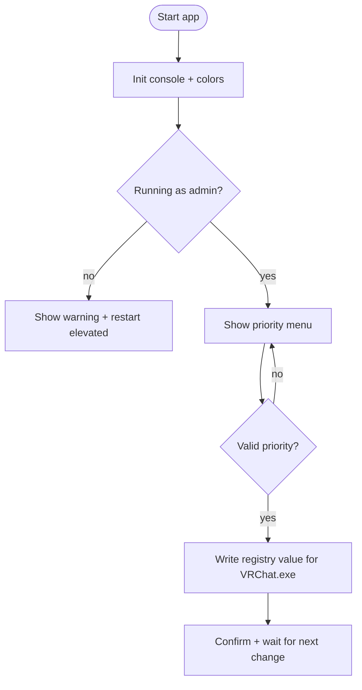

VRChat Priority Setter
======================

A small console helper that sets VRChat's process priority *before* the game launches by writing a registry value. No game files are touched.

Features
--------
- Elevates itself when needed, then writes the priority once.
- Keeps the UI readable in the console (VT100 colors, status lines).
- Open source, minimal footprint (few CPP/H headers).

Build
-----
1. Open `VRCHATPRIOSETTER.sln` in Visual Studio 2022.
2. Select `x64` + `Release` (or `Debug` for testing).
3. Build with `Ctrl+Shift+B`.
4. Optional: run `update_project.ps1` to regenerate the project files if you move sources again.

Usage
-----
Run the compiled `VRCHATPRIOSETTER.exe` as Administrator, choose a priority (2–6), then start VRChat. The change applies on the next launch.

Project Layout
--------------
- `src/` – all C++ sources and headers.
- `update_project.ps1` – regenerates `vcxproj` + filters to point at `src/`.

Flow (mermaid)
--------------

Notes
-----
- Needs administrative rights to modify `HKLM`.
- "Realtime" priority is not recommended; use `High` for safer results.
